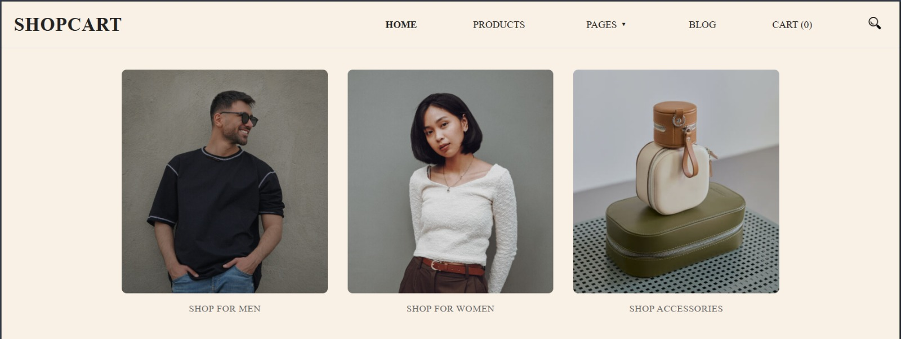

# 🛒 SHOPCART

An interactive and responsive e-commerce shopping cart web app built using **React JS**. It allows users to browse products, add items to the cart, manage quantities, and view the total price dynamically — all within a smooth interaction. Implemented product fetching from the third-party API -> Fakestore API

🔗 **Live Demo**: [SHOPCART on Netlify](https://shopcart-shopping.netlify.app/)  
📦 **GitHub Repo**: [SHOPCART GitHub](https://github.com/niyatic886/SHOPCART)

---

## 📌 Features

- 🧾 View a list of products with image, title, and price
- ➕ Add items to the cart
- ➖ Remove items from the cart
- 🔄 Adjust item quantities
- 🧮 Automatic total price calculation
- 🧼 Clear entire cart in one click
- ⚡ Fast and responsive UI using React components

---

## 🧰 Tech Stack

- **Frontend:** React JS (Hooks, Components)
- **Styling:** CSS (Custom Styles)
- **State Management:** useState, useEffect (React Hooks)
- **Deployment:** Netlify

---


## 📸 Screenshots

- **Laptop – 1024px**
  
  
  
  

- **Tablet – 768px**
  
  
   
  

- **Mobile – 425px**  
  
   
  

---

## 🎥 Video

> GitHub doesn’t support embedding `.mp4` directly in markdown, but you can link it.

📽️ [Watch Demo Video](./src/Images/video.mp4)


---


## 🚀 Getting Started

### Prerequisites

- Node.js & npm installed

### Installation

```bash
# Clone the repository
git clone https://github.com/niyatic886/SHOPCART.git

# Navigate into the project directory
cd SHOPCART

# Install dependencies
npm install

# Start the development server
npm start
